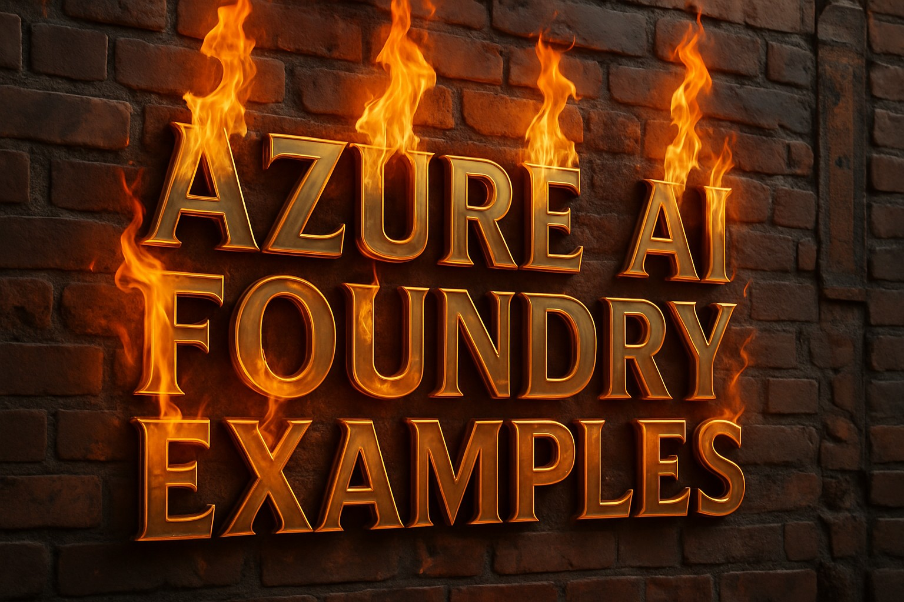

This repository contains examples demonstrating how to work with Azure AI Foundry and it's assets. AI Foundry is accessed at [ai.azure.com](http://ai.azure.com)

## 🔧 Prerequisites

To run the examples in this repository, you'll need to have the following resources deployed in your Azure AI Foundry environment:

- A text generation model like gpt-4o-mini
- An embedding model like text-embedding-3-small
- An AI search service (ideally with the semantic reanker option enabled)
- An Application Insights data source

Make sure these resources are properly deployed and configured before running the examples.

## 📚 Examples

🧮 [01_explore_hub_and_projects](./01_explore_hub_and_projects/README.md): A notebook to explore your Azure AI Foundry hub, associated projects, connections, and service deployments.

🧮 [02_configure_tracing_project_based_model_inference](./02_configure_tracing_project_based_model_inference/README.md): Shows how to configure tracing for project-based model inference. See [this example](./03_chat/chat_project_based_model_inference.py) for implementation.

🧮 [03_chat](./03_chat/README.md): A collection of examples demonstrating different ways to create chat applications using Azure AI Foundry assets, including a variety of SDKs with project-based model inference, project-based OpenAI, direct Azure OpenAI, and direct inference with and without streaming.

🧮 [04_chat_with_prompt_templates](./04_chat_with_prompt_templates/README.md): Examples demonstrating how to use prompt templates with Azure AI Foundry model assets, including programmatically created templates and templates loaded from .prompty files.

🧮 [05_project_based_ai_search](./05_project_based_ai_search/README.md): A notebook demonstrating how to use the default Azure AI Search connected to an Azure AI Foundry project to create a search index, upload documents, and perform a variety of search operations including exact match, fuzzy, vector, similarity, and hybrid.

🧮 [06_basic_rag](./06_basic_rag/README.md): A Jupyter notebook demonstrating a basic Retrieval-Augmented Generation (RAG) pattern implementation using an Azure AI Foundry project, an embedding model, a text generation model, and Azure AI Search, for space facts Q&A.

🧮 [07_safe_ai](./07_safe_ai/README.md): A Jupyter notebook demonstrating how to use Azure Content Safety to moderate text content with interactive widgets for adjusting moderation settings and testing different text inputs.

🧮 [08_agents](./08_agents/README.md): Examples demonstrating how to create and use AI agents with Azure AI Foundry, including a personal learning coach, grounding with Bing search, code interpreter, file search, and function calling capabilities.

🧮 [09_agents_with_semantic_kernel](./09_agents_with_semantic_kernel/README.md): Examples demonstrating how to create and use AI agents with Azure AI Foundry and Semantic Kernel. Includes interactive chat, code interpreter for data visualization, file search, and multi-agent collaboration.

## 🛠️ Setup Guide

### Requirements Management

The root `requirements.txt` file includes all dependencies needed for all examples in the repository.

### 🐳 Using the Dev Container

This repository includes a development container configuration that sets up all necessary dependencies automatically. The dev container is configured to work with all examples in this repository.

1. ✅ Open the project folder in VS Code
2. ✅ When prompted, click "Reopen in Container" or use the command palette and select *Dev Containers: Reopen in Container*
3. ✅ VS Code will build the container and set up the environment (this may take a few minutes the first time)
4. ✅ Once the container is running, you'll have a fully configured environment with all dependencies installed
5. ✅ The dev container includes the Azure CLI for authentication. You can use `az login` to authenticate with your Azure account

### 🔧 Manual Setup (without Dev Container)

If you prefer not to use the dev container:

1. Create a Python virtual environment:
   ```bash
   python -m venv venv
   source venv/bin/activate  # On Windows: venv\Scripts\activate
   ```

2. Install the required packages:
   ```bash
   pip install -r requirements.txt
   ```

3. Make sure you're authenticated with Azure:
   ```bash
   az login
   ```

### ⚙️ Environment Configuration

Most examples in this repository use environment variables for configuration, which are loaded from a `.env` file:

1. Copy the example environment file:
   ```bash
   cp .env.example .env
   ```

2. Edit the `.env` file and add the required configuration values specific to each example.
   - Project-based examples typically require an Azure AI Foundry project connection string
   - Direct SDK examples typically require an endpoint URL and API key

3. Optionally, adjust the logging level (DEBUG, INFO, WARNING, ERROR, CRITICAL):
   ```
   LOG_LEVEL=INFO
   ```

### 📝 Logging

The examples use Python's built-in logging module to log information at different levels:

- **DEBUG**: Detailed information, typically useful for debugging
- **INFO**: Confirmation that things are working as expected
- **WARNING**: Indication that something unexpected happened, but the application still works
- **ERROR**: Due to a more serious problem, the application has not been able to perform a function
- **CRITICAL**: A serious error, indicating that the application itself may be unable to continue running

Logs are written to example-specific log files in the application directory to avoid polluting the example output.

## 👨‍💻 Contributing

Contributions and suggestions are welcome! Please see the [contributing guidelines](CONTRIBUTING.md) for details.

## 📖 Resources

- [Introducing Azure AI Foundry](https://www.youtube.com/watch?v=GD7MnIwAxYM)
- [Azure AI Foundry Documentation](https://learn.microsoft.com/azure/ai-foundry)
- [Azure AI Inference API Documentation](https://learn.microsoft.com/en-us/azure/machine-learning/reference-model-inference-api?view=azureml-api-2&tabs=python)
- [Azure OpenAI Service Documentation](https://learn.microsoft.com/en-us/azure/ai-services/openai/)
- [Semantic Kernel GitHub repo](https://github.com/microsoft/semantic-kernel)
- [Semantic Kernel agent collaboration](https://learn.microsoft.com/en-us/semantic-kernel/frameworks/agent/agent-chat?pivots=programming-language-python)

## ❓ FAQ

<details>
<summary><strong>What is Azure AI Foundry?</strong></summary>
A successor to Azure AI Studio, it's a home for AI capabilities including a collection of tools and services to fully create, manage, and use AI models at scale for data scientists and AI engineers.
</details>

<details>
<summary><strong>What is the difference between an Azure AI Foundry hub and project?</strong></summary>
A hub is a parent workspace that provides shared resources including storage, key vault, and compute for multiple child projects. Projects are lighter weight workspaces for managing AI components that inherit and use the hub's resources. Think of hubs as infrastructure and resource providers and projects as workspaces for specific AI development efforts.

A hub can have many projects, but a project can have only 1 parent hub. A project can have it's own data, connections, and model deployements that are isolated to the project itself, and not part of the hub.
</details>

<details>
<summary><strong>What is the difference between the managed compute and serverless API deployment options?</strong></summary>

Deployment options differ primarily in pricing structure and infrastructure approach.

**Serverless deployment**:
- Pay-as-you-go model based on token usage (input, output, and reasoning tokens)
- Runs on shared GPU cluster pools specific to each model
- Can utilize global pools, or region-specific pools (like East US or Sweden Central)

**Managed compute**:
- Hourly billing model regardless of usage
- Runs on dedicated virtual machines with the model and API pre-deployed
- Microsoft handles all infrastructure management and deployment
</details>

<details>
<summary><strong>What is the difference between the Azure AI inferencing API and OpenAI API?</strong></summary>

The Azure AI inferencing API (package `azure.ai.inference`) serves as an abstraction layer that allows applications to interact with various models using a standardized interface. It translates requests to the specific format required by each underlying model.

While `azure.ai.inference` provides a model-agnostic abstraction layer, the openai package with the AzureOpenAI client (i.e., `from openai import AzureOpenAI`) is specifically designed for interacting with OpenAI models deployed on Azure. 

In summary, the key benefit of `azure.ai.inference` is the ability to switch between supported models, for example between an OpenAI and Meta model, without modifying your application code, avoiding code lock-in.

Verify model compatibility via the [inference API documentation](https://learn.microsoft.com/en-us/azure/machine-learning/reference-model-inference-api?view=azureml-api-2&tabs=python).
</details>

<details>
<summary><strong>What is RAG?</strong></summary>
Retrieval-Augmented Generation (RAG) is a technique where the LLM (Large Language Model) uses relevant retrieved text chunks from your data to craft a final answer.
This helps ground the model's response in real data, reducing hallucinations.
</details>

<details>
<summary><strong>What is Semantic Kernel?</strong></summary>
Semantic Kernel is a lightweight, open-source development kit that lets you easily build AI agents and integrate the latest AI models into your C#, Python, or Java codebase. It serves as an efficient middleware that enables rapid delivery of enterprise-grade solutions.
</details>


<details>
<summary><strong>In Semantic Kernel, what is a kernel</strong></summary>
An SK kernel is the central orchestration component that serves as the main entry point to the framework. It manages integration with AI services like Azure OpenAI, memory sharing, and function registry and execution.
</details>
